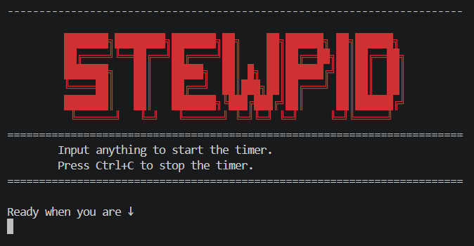
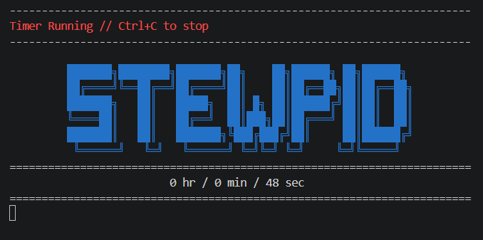
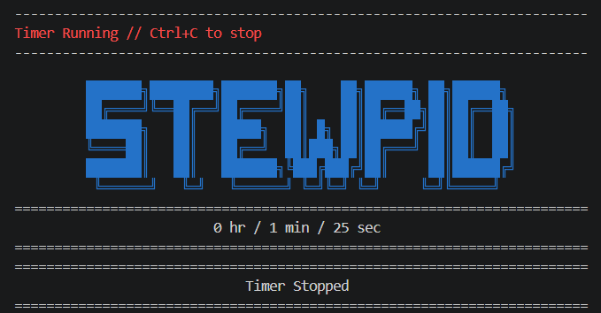

# Stewpid Stop Watch v2.0

> A stupidly simple stopwatch with a slightly cooler TUI.  
> **Works on Windows, macOS & Linux.**

Had this idea **at school**, came home, opened VS Code, and boom yehh . . .

### [ Screenshots ]

|                 [ START ]                  |               [ RUNNING ]                |                [ STOPPED ]                |
| :----------------------------------------: | :--------------------------------------: | :---------------------------------------: |
|  |  |  |

### [ Built With ]


### [ Run ]

```bash
python3 main.py
```

**Start:** type anything + Enter  
**Stop:** **`Ctrl+C`**

---

### [ Why? ]

Because I wanted to make one.

**Documentations, mini-research, and questionable amounts of free time.**
